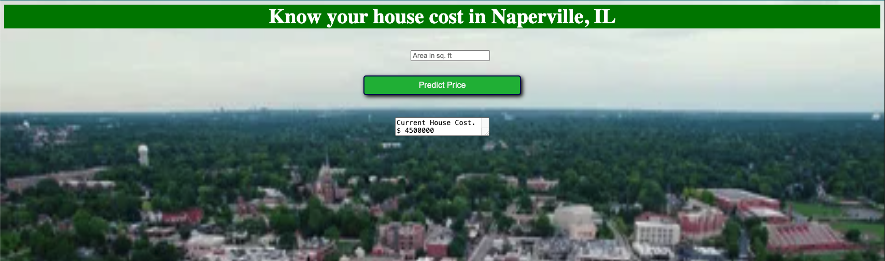

# House-Price-Predictor
In this project, I developed a basic model to predict house prices based on a single feature: the area of the property. Due to the simplicity of the dataset, I chose a linear regression algorithm for prediction. After training the model, I saved the parameters in a pickle file and deployed the model to a web application using Flask.

To run this project, following dependencies are required-

--> flask
To install flask in your system, use command 

>> pip install flask
--> sklearn

To install sklearn in your system, use command 
>> pip install sklearn

--> Pandas
To install Pandad in your system, use command 

>> pip install pandas
--> pickle

To install pickle in your system, use command 
>> pip install pickle

To run the project in your system, type command in your command prompt or terminal
>> python app.py

    

       
